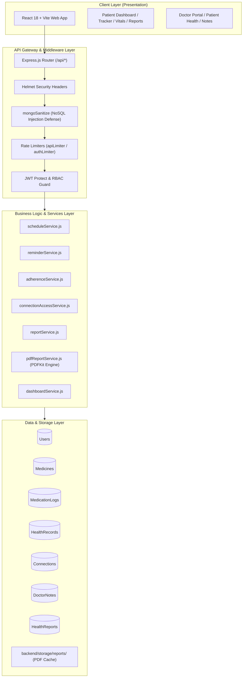

# MediTrack+ – Smart Medication & Health Management System

[](#)
[-teal.svg)](#)
[](#)
[](#)

> **MediTrack+** is an enterprise-grade digital healthcare platform engineered to solve medication non-adherence, consolidate fragmented physiological telemetry, and provide role-governed clinical connectivity between patients and authorized healthcare providers.

---

## Table of Contents
- [1. Overview & Motivation](#1-overview--motivation)
- [2. Problem Statement & Objectives](#2-problem-statement--objectives)
- [3. Complete Feature Modules](#3-complete-feature-modules)
- [4. System Architecture](#4-system-architecture)
- [5. Technology Stack](#5-technology-stack)
- [6. API Reference Matrix](#6-api-reference-matrix)
- [7. Security Architecture & 5-Layer Authorization](#7-security-architecture--5-layer-authorization)
- [8. Installation & Quickstart](#8-installation--quickstart)
- [9. Environment Configuration](#9-environment-configuration)
- [10. Testing & Verification](#10-testing--verification)
- [11. Production Deployment (Render & Atlas)](#11-production-deployment-render--atlas)
- [12. Academic & Demonstration Guide](#12-academic--demonstration-guide)

---

## 1. Overview & Motivation

Non-adherence to prescribed medication regimens is one of the leading drivers of preventable hospital readmissions and chronic illness complications globally. Patients often face complex multi-drug schedules, scattered paper health records, and no continuous visibility into how their vital signs correlate with medication consistency.

**MediTrack+** solves this by uniting:
- **Patients**: Dynamic dose scheduling, automated reminders, mathematical adherence scores, biometric tracking, and downloadable PDF telemetry summaries.
- **Physicians**: Verified clinical identity, searchable directory, explicit connection approvals, permitted health record inspection, and role-segregated private notes alongside patient-visible recommendations.

---

## 2. Problem Statement & Objectives

### Problem Statement
1. **Dose Confusion & Missed Medicines**: Regimens with varying daily frequencies lead to omitted or untimely doses.
2. **Disconnected Health Metrics**: Blood pressure, blood sugar, weight, and heart rate are recorded on disparate paper logs.
3. **Insecure Data Sharing**: Patients and physicians lack a zero-trust, permission-governed environment for reviewing clinical records without exposing unrelated personal data.

### Core Objectives
- **Zero-Clutter Scheduling**: Calculate daily dosage timelines dynamically on demand without pre-generating redundant database rows.
- **Deterministic Adherence**: Calculate clinical adherence rates ($\text{Score} = \frac{\text{Taken}}{\text{Eligible}} \times 100$) and consecutive streaks with strict grace period rules.
- **Granular Access Gates**: Enforce a 5-layer authorization chain for doctor health record and report access.
- **Publication-Ready Reporting**: Compile longitudinal telemetry into structured JSON summaries and stream branded, printable PDF documents via server-side PDFKit.

---

## 3. Complete Feature Modules

### 1. Authentication & Role-Based Access Control (RBAC)
- Stateless authentication using JSON Web Tokens (JWT) and `bcryptjs` password hashing (salt work factor 12).
- Strict role isolation: `patient`, `doctor`, and `admin`.
- Inactive account protection (`isActive: false` checks) and automated cookie/header token synchronization.

### 2. Medication Management & Dynamic Scheduling
- Support for complex medical frequencies: `once_daily`, `twice_daily`, `three_times_daily`, `four_times_daily`, and `custom` (up to 12 doses/day).
- Strict medical unit validation: `mg`, `g`, `mcg`, `ml`, `tablet`, `capsule`, `drop`, `puff`, `unit`.
- On-demand daily schedule generator: updates instantly upon prescription edits without data anomalies.

### 3. Smart Medication Reminders & Recovery
- Timezone-aware notification scheduler operating via background `node-cron`.
- Automated server restart recovery within a controlled 15-minute window to prevent notification storms.
- Idempotent compound unique indexes preventing duplicate reminder generation.

### 4. Dose Tracking & Adherence Analytics
- State machine for each scheduled dose: `pending` $\rightarrow$ `taken`, `missed`, or `skipped`.
- Mathematical adherence percentage calculated across 7-day, 30-day, and custom calendar ranges.
- Evaluates consecutive adherence streaks ($\ge 100\%$ compliance).
- Future doses are strictly excluded from eligible doses to avoid penalizing patients prematurely.

### 5. Biometric Health Records & Longitudinal Analytics
- Tracks physiological parameters: Blood Pressure (dual systolic/diastolic), Blood Sugar, Heart Rate, Weight, and Temperature.
- Validated biological boundary enforcement and future date prevention.
- Recharts-powered responsive area charts, trend metrics, and personal baseline comparisons.

### 6. Doctor Directory, Verification & Care Team Network
- Searchable doctor directory by name, medical specialization, and hospital affiliation.
- Explicit connection lifecycle: `pending` $\rightarrow$ `approved`, `rejected`, or `revoked`.
- Patient Care Team manager (`/my-doctors`) and Physician Roster manager (`/doctor/connections`).

### 7. Clinical Notes & Patient Guidance
- **Private Doctor Notes**: Visible strictly to the authoring doctor; never exposed to patients or included in reports.
- **Patient-Visible Recommendations**: Clinical guidance prioritized by `normal`, `important`, or `urgent` tiers with automatic in-app alerts.

### 8. Automated Health Reports & Server-Side PDF Generation
- Scheduled compiler creates structured JSON telemetry records for weekly, monthly, and custom periods.
- Server-side PDFKit rendering engine streams branded A4 reports with demographics, adherence graphs, vitals tables, physician guidance, and medical safety disclaimers.

### 9. Unified Dashboards
- **Patient Dashboard (`Dashboard.jsx`)**: Active medication counts, today's schedule checklist, adherence gauge, vitals overview, connected doctors, recent recommendations, and 1-click PDF download.
- **Doctor Dashboard (`DoctorDashboard.jsx`)**: Credential verification tracker, patient search, actionable pending invitations, and patient health shortcuts.

---

## 4. System Architecture



---

## 5. Technology Stack

| Layer | Technologies | Purpose |
| :--- | :--- | :--- |
| **Frontend** | React 18, Vite 8, Tailwind CSS | High-performance reactive UI with responsive healthcare SaaS design |
| **Routing & Navigation** | React Router v6 | Role-based protected client routing (`ProtectedRoute`, `RoleRoute`) |
| **Charts & Icons** | Recharts, Lucide React | Visual biometric trend charting and modern iconography |
| **Backend Runtime** | Node.js (v18 / v20 LTS), Express.js 4 | Asynchronous RESTful API micro-architecture |
| **Database** | MongoDB Atlas, Mongoose 8 | Document-oriented schema modeling with compound unique indexes |
| **PDF Generation** | PDFKit | Server-side binary PDF streaming and clinical document design |
| **Security & Auth** | bcryptjs, jsonwebtoken, Helmet | Work factor 12 password salting, stateless JWTs, secure HTTP headers |
| **Sanitization & Limiting** | Custom mongoSanitize, express-rate-limit | Zero-trust NoSQL operator stripping and brute-force mitigation |
| **Task Automation** | node-cron | Periodic medication reminders, missed dose detection, and report compilation |

---

## 6. API Reference Matrix

### Authentication & Profiles (`/api/auth`, `/api/users`)
- `POST /api/auth/register` — Register patient account
- `POST /api/auth/doctor/register` — Register physician account with credentials
- `POST /api/auth/login` — Authenticate user and issue JWT
- `POST /api/auth/logout` — Clear authentication cookies
- `GET  /api/auth/me` — Retrieve authenticated user profile
- `GET  /api/users/profile` — Get personal profile details
- `PUT  /api/users/profile` — Update patient profile information

### Medication Management (`/api/medicines`, `/api/medication-logs`)
- `GET    /api/medicines` — List medications with search and status filter
- `POST   /api/medicines` — Create new medication schedule
- `GET    /api/medicines/:id` — Inspect medication details
- `PUT    /api/medicines/:id` — Update medication schedule
- `PATCH  /api/medicines/:id/deactivate` — Soft-deactivate medication
- `GET    /api/medicines/schedule/today` — Today's dynamic dosage schedule
- `GET    /api/medication-logs/today` — Today's dose checklist and completion stats
- `PATCH  /api/medication-logs/:id/taken` — Mark dose as taken
- `PATCH  /api/medication-logs/:id/skipped` — Mark dose as skipped with notes

### Health Tracking & Analytics (`/api/health-records`, `/api/analytics`)
- `POST   /api/health-records` — Record biometric vitals
- `GET    /api/health-records` — Paginated vitals history with date filters
- `PATCH  /api/health-records/:id` — Update a health measurement
- `DELETE /api/health-records/:id` — Delete a health record
- `GET    /api/analytics/adherence` — Mathematical adherence rate and streak
- `GET    /api/analytics/health` — Longitudinal trend telemetry for Recharts
- `GET    /api/analytics/health/insights` — Non-diagnostic personal baseline insights

### Doctor Network & Clinical Records (`/api/doctors`, `/api/connections`, `/api/patients`)
- `GET   /api/doctors` — Search verified physicians directory
- `POST  /api/connections` — Initiate doctor connection request
- `PATCH /api/connections/:id/accept` — Physician accepts patient invitation
- `PATCH /api/connections/:id/reject` — Physician declines patient invitation
- `PATCH /api/connections/:id/revoke` — Revoke approved connection
- `PATCH /api/connections/:id/permissions` — Patient updates doctor access permissions
- `GET   /api/doctors/patients/:patientId/health-records` — View patient vitals (5-layer auth)
- `POST  /api/doctors/patients/:patientId/notes` — Create clinical note or recommendation
- `GET   /api/doctors/patients/:patientId/notes` — List notes for patient
- `GET   /api/patients/me/doctor-recommendations` — Patient views active physician guidance

### Reports & Dashboards (`/api/reports`, `/api/dashboard`)
- `POST /api/reports/generate` — Compile structured health report
- `GET  /api/reports` — List generated reports
- `GET  /api/reports/:id` — Inspect structured report JSON
- `GET  /api/reports/:id/pdf` — Stream generated PDF inline
- `GET  /api/reports/:id/download` — Download report as PDF attachment
- `GET  /api/dashboard/patient` — Consolidated patient dashboard telemetry
- `GET  /api/dashboard/doctor` — Consolidated doctor dashboard and roster telemetry

---

## 7. Security Architecture & 5-Layer Authorization

MediTrack+ enforces zero-trust principles across all routes:

### 1. 5-Layer Clinical Access Gate
A doctor requesting patient health records or reports is validated through five immutable checks:
```
1. JWT Token Validity (valid signature, non-expired)
      ↓
2. Doctor Role (req.user.role === 'doctor')
      ↓
3. Account Status (both doctor and patient isActive: true)
      ↓
4. Connection State (DoctorPatientConnection.status === 'approved')
      ↓
5. Explicit Permission Gate (permissions.healthRecords === true / permissions.reports === true)
```

### 2. Insecure Direct Object Reference (IDOR) Defense
- All user-specific operations derive ownership strictly from `req.user.id` (cryptographically validated via JWT).
- Any client-supplied `userId` or `doctorId` in request bodies or query parameters is sanitized and ignored.

### 3. NoSQL Injection Defense
- Custom `mongoSanitize` middleware inspects `req.body`, `req.query`, and `req.params`, recursively removing keys starting with `$` or containing `.`.

---

## 8. Installation & Quickstart

### Prerequisites
- Node.js (v18.x or v20.x LTS)
- npm (v9.x or v10.x)
- MongoDB (local instance or MongoDB Atlas connection string)

### 1. Clone & Install Dependencies
```bash
git clone https://github.com/akashkbiju/Mern-Medi-Track.git
cd Mern-Medi-Track/meditrack-plus

# Install backend dependencies
cd backend && npm install

# Install frontend dependencies
cd ../frontend && npm install
```

### 2. Configure Environment Files
- Copy `backend/.env.example` to `backend/.env` and configure your credentials.
- Copy `frontend/.env.example` to `frontend/.env`.

### 3. Run Development Servers
From `meditrack-plus/backend`:
```bash
npm run dev
```
From `meditrack-plus/frontend`:
```bash
npm run dev
```
Open [http://localhost:5173](http://localhost:5173) in your browser.

---

## 9. Environment Configuration

### Backend (`backend/.env`)
```env
PORT=5000
NODE_ENV=development
MONGODB_URI=mongodb+srv://<username>:<password>@cluster.mongodb.net/meditrack
CLIENT_URL=http://localhost:5173
JWT_SECRET=your_super_secret_jwt_key_at_least_32_characters
JWT_EXPIRES_IN=1d

# Scheduler Settings
REMINDER_CRON_SCHEDULE=* * * * *
REMINDER_LOOKAHEAD_HOURS=24
REMINDER_RECOVERY_MINUTES=15
REMINDER_GRACE_MINUTES=60
REPORT_GENERATION_ENABLED=true
REPORT_GENERATION_CRON=0 0 * * *
```

### Frontend (`frontend/.env`)
```env
VITE_API_URL=http://localhost:5000/api
```

---

## 10. Testing & Verification

MediTrack+ includes **17 automated test suites** covering all system layers:

```bash
cd backend
npm run test:all
```

### Verification Matrix
- `medicineModel.test.js` — Prescription validation & boundaries
- `scheduleLogic.test.js` — Dynamic scheduling engine
- `reminderEngine.test.js` — Timezone-aware reminder calculations
- `medicationLog.test.js` — Dose state machine transitions
- `adherence.test.js` — Mathematical adherence & streak calculations
- `healthRecord.test.js` — Physiological ranges & future date guards
- `healthAnalytics.test.js` — Statistical trend calculations
- `healthInsight.test.js` — Personal baseline comparisons
- `notification.test.js` — In-app notification delivery
- `doctor.test.js` — Physician onboarding & credentials
- `connection.test.js` — Invitation request & approval lifecycle
- `doctorHealthAccess.test.js` — 5-layer clinical authorization chain
- `doctorNote.test.js` — Private notes vs patient recommendations
- `healthReport.test.js` — Structured telemetry compilation
- `pdfReport.test.js` — PDFKit binary generation & security
- `dashboard.test.js` — Aggregated dashboard payloads
- `securityHardening.test.js` — NoSQL sanitization & JWT tamper defense

**Frontend Build Verification**:
```bash
cd frontend && npm run build
```

---

## 11. Production Deployment (Render & Atlas)

The repository includes a production-ready `render.yaml` blueprint:

1. **MongoDB Atlas**: Create a free M0 cluster, whitelist IP `0.0.0.0/0`, and copy your connection string.
2. **Render**:
   - Link your GitHub repository (`akashkbiju/Mern-Medi-Track`).
   - Create a **New Blueprint Instance** pointing to `meditrack-plus/render.yaml`.
   - Provide `MONGODB_URI` in the environment prompt.
   - Render automatically deploys the backend Node.js web service and the static Vite frontend with zero-downtime rolling deploys.

---

## 12. Academic & Demonstration Guide

A complete 14-chapter academic MCA documentation report is available at [`docs/MCA_FINAL_DOCUMENTATION.md`](docs/MCA_FINAL_DOCUMENTATION.md), including:
- System Architecture & Entity-Relationship (ER) Diagrams
- Use Case & Data Flow Diagrams (DFD)
- 5–10 Minute Demonstration Script
- Comprehensive Viva Voce Examination Cheat Sheet

---

## License
Developed as an MCA Final Project. Licensed under the [MIT License](LICENSE).
