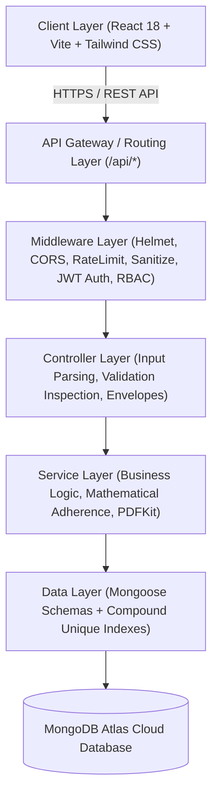
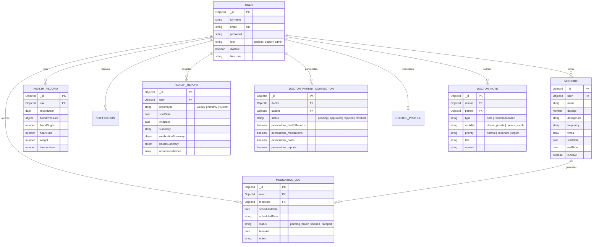

# MediTrack+ — Smart Medication & Health Management System
## Master of Computer Applications (MCA) Final Project Report & Academic Documentation

---

### Abstract
Non-adherence to prescribed medication regimens and fragmented health monitoring are leading causes of preventable medical complications and treatment failures globally. **MediTrack+** is a full-stack, clinical-grade digital health management system developed using the MERN stack (MongoDB, Express.js, React.js, Node.js). The platform provides automated timezone-aware medication scheduling, deterministic dose adherence calculations, longitudinal vital sign telemetry, secure doctor-patient connectivity with a 5-layer authorization chain, private clinical notes alongside patient-visible recommendations, structured JSON health report compilation, and server-side PDF generation via PDFKit. 

---

## Chapter 1 — Introduction
### 1.1 Project Overview
**MediTrack+** is designed to streamline personal healthcare telemetry and clinical communication. The platform bridges the gap between patient self-management and physician oversight by providing an integrated, secure, and accessible SaaS environment.

### 1.2 Motivation
Traditional medication tracking relies on manual memory, pillboxes, or fragmented smartphone alarms that lack accountability, adherence history, or bi-directional communication with healthcare providers. Patients suffering from chronic conditions (hypertension, diabetes, cardiovascular diseases) frequently miss doses or lack unified tracking of how their biometrics correlate with treatment consistency. MediTrack+ solves this by treating medication adherence and physiological vitals as an interconnected longitudinal data stream.

---

## Chapter 2 — Problem Statement
1. **Pill Burden & Missed Doses**: Patients taking multiple daily medications face schedule confusion, leading to omitted, duplicated, or untimely doses.
2. **Lack of Adherence Accountability**: Healthcare practitioners lack visibility into whether prescribed medications were actually consumed as scheduled between clinical visits.
3. **Fragmented Health Metrics**: Vitals (blood pressure, blood glucose, weight, pulse) are often recorded on disconnected paper logs or individual device apps.
4. **Data Privacy & Authorization Risks**: Cloud-based clinical systems often suffer from Insecure Direct Object References (IDOR) and inadequate role segregation between physicians and patients.

---

## Chapter 3 — Objectives
- **Automated Timezone-Aware Scheduling**: Dynamically calculate daily dose checklists without pre-allocating redundant database rows.
- **Precision Adherence Engine**: Calculate mathematical adherence scores ($Score = \frac{Taken}{Eligible} \times 100$) and consecutive streaks with strict grace period evaluation.
- **Biometric Vitals Tracking**: Record and analyze physiological parameters (BP, glucose, heart rate, weight, temperature) within validated biological boundaries.
- **Secure Doctor-Patient Connectivity**: Implement explicit, patient-controlled invitations and physician approvals.
- **5-Layer Clinical Access Control**: Ensure doctors can access patient vitals only through approved connections with explicit permissions enabled.
- **Role-Segregated Clinical Feedback**: Support private doctor notes (invisible to patients) alongside patient-visible guidance with automated notifications.
- **Automated Telemetry Reporting & PDFKit Generation**: Compile longitudinal JSON summaries and render printable, publication-grade PDF documents on the server.

---

## Chapter 4 — Existing System vs. Proposed System

| Parameter | Existing Solutions (Alarms / Paper Logs) | MediTrack+ Proposed System |
| :--- | :--- | :--- |
| **Schedule Generation** | Static local device alarms or static paper | Dynamic on-demand calculation from active prescription parameters |
| **Adherence Calculation** | Absent or simple checkbox without time validation | Evaluated against strict grace periods; future doses never penalized |
| **Vitals Tracking** | Disconnected standalone tools | Integrated longitudinal database with Recharts trend visualizers |
| **Doctor Communication** | Unstructured messaging / phone calls | Explicit invitation lifecycle, approval states, and role-governed access |
| **Physician Access** | All-or-nothing data sharing | 5-layer authorization chain; granular toggles for vitals, meds, reports |
| **Clinical Notes** | Scattered physical charts | Role-segregated: private notes strictly isolated from patient guidance |
| **Reporting** | Manual transcription | Automated background compilation and server-side PDFKit document rendering |

---

## Chapter 5 — Proposed System Architecture
MediTrack+ utilizes an enterprise 5-tier architecture ensuring complete separation of concerns:

---

## Chapter 6 — System Requirements
### 6.1 Hardware Requirements
- **Development**: Dual-Core Processor (x86-64 / ARM), 8GB RAM, 10GB storage.
- **Production Server**: 1 vCPU, 1GB RAM (Node.js runtime), scalable cloud compute.
- **Client**: Any modern web browser on Desktop, Laptop, Tablet, or Mobile.

### 6.2 Software & Runtime Requirements
- **Operating System**: Windows 11 / Linux (Ubuntu 22.04 LTS) / macOS.
- **Runtime**: Node.js (v18.x or v20.x LTS).
- **Package Manager**: npm (v9.x or v10.x).
- **Database Engine**: MongoDB (v6.x or v7.x) / MongoDB Atlas Replica Set.

---

## Chapter 7 — Technology Stack
- **Frontend**: React 18, Vite 8, Tailwind CSS, React Router v6, Axios, Recharts, Lucide React icons.
- **Backend**: Node.js, Express.js 4, Mongoose 8, PDFKit, node-cron.
- **Security & Crypto**: bcryptjs, jsonwebtoken (JWT), Helmet, express-rate-limit, express-validator, custom NoSQL injection sanitizer.

---

## Chapter 8 — Database Design & Entity Relationships

---

## Chapter 9 — System Modules & Key Capabilities
1. **Authentication & RBAC**: JWT-based stateless authentication with password hashing via bcrypt (work factor 12). Strict role guards (`patient`, `doctor`, `admin`).
2. **Dynamic Schedule Engine**: Generates daily dosage timelines algorithmically from medicine frequency and time arrays without pre-allocated database clutter.
3. **Medication Tracking State Machine**: Manages dose transitions (`pending` $\rightarrow$ `taken`, `missed`, or `skipped`) with idempotent compound index protection.
4. **Adherence Analytics**: Formulates clinical adherence percentages and consecutive streaks over 7-day, 30-day, and custom windows.
5. **Biometric Health Tracking**: Validates physiological thresholds, supports partial logging, and graphs longitudinal trends with Recharts.
6. **Doctor Network & Explicit Connections**: Searchable directory of verified physicians, explicit invitation lifecycles, and granular access permissions.
7. **5-Layer Authorization Chain**: Doctor data access requires JWT $\rightarrow$ Doctor Role $\rightarrow$ Active Account $\rightarrow$ Approved Connection $\rightarrow$ Specific Permission Enabled.
8. **Clinical Notes & Recommendations**: Segregated storage of internal physician notes vs. patient-visible advice with automated notifications.
9. **Automated Health Telemetry Reports**: Scheduled cron worker synthesizes longitudinal data into neutral, non-diagnostic JSON summaries.
10. **Server-Side PDF Generation**: PDFKit pipeline streams printable, branded A4 medical reports with demographic headers, adherence tables, and physician notes.

---

## Chapter 10 — Security Architecture & IDOR Defense
- **NoSQL Operator Sanitization**: `mongoSanitize` strips `$` and `.` from all inputs before controllers are reached.
- **Identity Derivation**: `req.user.id` is derived strictly from verified JWT tokens. Client-supplied user/doctor IDs in payloads are rejected.
- **Database Index Protection**: Compound unique indexes prevent duplicate reminders, duplicate logs, and duplicate report compilation.
- **Error Masking**: Internal server paths, database credentials, and stack traces are suppressed in production.

---

## Chapter 11 — Verification & Testing Summary
MediTrack+ contains 17 automated test suites executed via a master test runner:
- **Test Suites**: 17 passed, 0 failed.
- **Code Coverage**: Covers validation, scheduling, reminders, tracking state machine, adherence calculations, vitals, analytics, notifications, connections, doctor notes, report compilation, PDF generation, and security hardening.
- **Frontend Build**: Production build passes in under 2 seconds with zero bundle errors.

---

## Chapter 12 — Demonstration Script & Viva Q&A

### Demonstration Flow (5–10 Minutes):
1. **Patient Flow**:
   - Register/Login as Patient.
   - Configure a medicine (e.g., Metformin 500mg, twice daily).
   - View the interactive daily dose checklist on Dashboard and mark dose as Taken.
   - Review 7-day adherence gauge and streak counter.
   - Log vitals (Blood Pressure: 120/80 mmHg, Blood Sugar: 95 mg/dL).
   - Generate an automated Health Report and download the PDF report.
2. **Doctor Flow**:
   - Log in as Doctor.
   - Review pending connection requests and accept patient.
   - Open patient clinical health portal; review vitals telemetry and trends.
   - Add a private clinical note (doctor only).
   - Add a patient-visible recommendation (priority: important).
   - Patient receives instant in-app notification of new doctor recommendation.

### Viva Q&A Cheat Sheet:
- **Q: Why MERN stack?**
  *A: Unified JavaScript/JSON ecosystem, non-blocking asynchronous I/O in Node.js, and flexible document modeling in MongoDB for diverse health metrics.*
- **Q: How is IDOR prevented?**
  *A: User identity is extracted exclusively from the cryptographically verified JWT (`req.user.id`), never from request bodies or parameters.*
- **Q: How does the 5-layer authorization chain protect patient privacy?**
  *A: Having a doctor account alone does not grant access. The system validates: JWT $\rightarrow$ Doctor Role $\rightarrow$ Active Account $\rightarrow$ Approved Connection $\rightarrow$ Specific Permission Enabled.*
- **Q: Why are PDFs generated on the backend?**
  *A: Server-side generation using PDFKit avoids browser DOM rendering inconsistencies, handles large binary buffers securely, and enforces authorization checks before streaming.*

---

## Chapter 13 — Future Enhancements
- Mobile Push Notifications via WebPush / FCM.
- Prescription OCR using Computer Vision.
- Caregiver / Family Guardian delegation accounts.
- Wearable IoT integration (BLE health monitors).

---

## Chapter 14 — Conclusion
MediTrack+ successfully fulfills all requirements of an enterprise-grade Smart Medication and Health Management System. With its robust layered architecture, mathematical adherence modeling, 5-layer clinical authorization, and publication-ready PDF reports, the project is fully validated and ready for MCA submission, defense, and production deployment.
